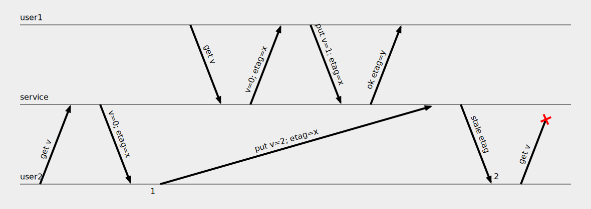

# draw-a-lamport



A very simple tool to draw what I call a Lamport diagram or a causality diagram.
This type of diagram is used to show how concurrent processes interact with each other.
It's pretty similar to the sequence diagram, but it also allows to show how messages are delayed or reordered in flight.
I find myself needing this pretty often but I'm not aware of any tool that can draw them.

This type of diagram was probably introduced in the Leslie Lamport's famous [paper][1] "Time, Clocks, and the Ordering of Events in a Distributed System", hence the name.

## Running

``` sh
python main.py <source-file> <target-file>
```

Sorry, I couldn't force myself to check what's the state of the art of Python packaging this week.

## Syntax

### Comments

You can use comments anywhere in the source file.
A comment is a line starting with `#`:

```
# This is a comment
```

### Actors

First we specify the actors, one per line.
They are rendered in the order given here.

```
user1
user2
service
```

### Simple events

Next come the events, also one per line.
We must separate actors from events with a blank line; from here on you can use blank lines freely for readability.

To make `actor1` send a message `msg` and `actor2` receive it, you type:

```
s actor1 msg
r actor2 msg
```

Message is any non-empty string.

The message can also be lost on the way to `actor2`:

```
s actor1 msg
x actor2 msg
```

### Message ID

To avoid repeating yourself when message is longer than one word, you can use another syntax:

```
s actor1 msg: a very long message
r actor2 msg
```

This also allows to have many different messages with the same text.

### Message text placement

By default the message text is placed in the middle of the message line.
Lines on the diagram might sometimes cross each other making the message text hard to read.
To fix that you can force start or end alignment like this:

```
s actor1 req: <a request
r actor2 req
s actor2 rsp: >a response
r actor1 rsp
```

Or you might skip the message text entirely when it's obvious or doesn't matter:
```
s actor1 req: <a request
r actor2 req
s actor2 rsp:
r actor1 rsp
```

### Markers

Lastly you can place markers to, well, mark some event to describe it.

```
1s actor1 msg
2r actor2 msg
```

## Example

The diagram above was rendered from the following source:

```
user1
service
user2

# user 2 gets the current state
s user2 get2: get v
r service get2
s service etag2: v=0; etag=x
r user2 etag2

# user 2 sends a request to update state, but its delivery is delayed
1s user2 put2: put v=2; etag=x

# user 1 gets the current state
s user1 get1: get v
r service get1
s service etag1: v=0; etag=x
r user1 etag1

# user 1 succesfully updates state
s user1 put1: put v=1; etag=x
r service put1
s service ok1: ok etag=y
r user1 ok1

# the delayed request from user2 reaches the service
# it is rejected because of the stale etag
r service put2
s service nok: stale etag
2r user2 nok

# user 2 tries to get current state, but the request is lost
s user2 get: get v
x service get
```

[1]: https://lamport.azurewebsites.net/pubs/time-clocks.pdf
